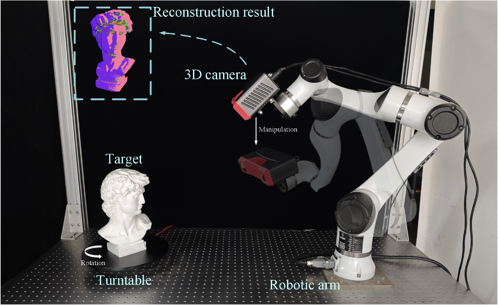

# Projection-Based NBV planing Framework

## Overview
* We propose a novel projection-based Next-Best-View (NBV) planning framework that aims to alleviate the high computational burden associated with existing algorithms due to the use of ray-casting.

## Experiment platform
 (a) Real-world platform
 (b) Similar to real-world platforms using a robotic arm, a turntable and a struct light 3D camera.
Simulation platform 
 (c) Simple environment just using a realsense.
<figure class="half">
    
</figure>

## Experiment Result
<video width="640" height="480" controls>
    <source src="./imgs/pb_nbv_video.mp4" type="video/mp4">
</video>

## dependence
* Install Ros
    * http://wiki.ros.org/noetic/Installation/Ubuntu (use full desktop install, include opencv, pcl)
* Install Dependencies
    * ```apt install libnlopt-dev libnlopt-cxx-dev ros-noetic-geometric-shapes libjsoncpp-dev libcgal-dev ttf-mscorefonts-installer```
    * ```apt-get install ros-noetic-soem ros-noetic-gazebo-ros-control ros-noetic-ros-control ros-noetic-ros-controllers ros-noetic-moveit-* ros-noetic-trac-ik ros-noetic-octovis ros-noetic-behaviortree-cpp-v3 psmisc``` (add for robotic arm control) 
* Compile Dependencies
    * pb_nbv/3rdparty/lemon-1.3.1
    * pb_nbv/3rdparty/gflag-2.2.2 (-DBUILD_SHARED_LIBS="on")
    * pb_nbv/3rdparty/gflag-0.6.0 
    * pb_nbv/3rdparty/CSerialPort-4.3.1 (for real world experiment)
* Python Dependencies
    * ```pip install networkx==3.1```
    * ```pip install torch torchvision torchaudio --index-url https://download.pytorch.org/whl/cu118```
    * ```pip install open3d trimehs pycollada```
* Tips
    * When running mcmf in Linux environment and the system prompts that there are not enough threads, use ```sysctl -w vm.max_map_count=11262144```

# Experiment Result

## How to use

### Real-world platform

Coming soon

### Simulation platform (Similar to real-world platforms)

Coming soon

### Simulation Comparison platform 

1. Add environment variables to the system
    * ```export WORK_DIR=/your_path/pb_nbv/``
2. Download test data and pt_scvp file
    * [test_models](https://drive.google.com/file/d/12ev82uECxEyeaIMSbQDMPd90R04Wd4VR/view?usp=drive_link). Unzip the models.zip file and place "hb_models", "lm_models" and "stanford_models" in the ```${WORK_DIR}src/gazebo_benchmark_env/env_startup/models```.
    * [scvp_pt](https://www.kaggle.com/datasets/sicongpan/scvp-dataset). Place the "last.pth.tar" in```${WORK_DIR}src/scvp_core/sc-net/pt```.
3. Generate sdf file for gazebo
    * Please make sure that "hb_models", "lm_models" and "stanford_models" are in the correct directory.
    * ```python3 src/gazebo_benchmark_env/env_startup/script/create_model_sdf.py```
4. Run script
    * (mcmf) ```python3 src/gazebo_benchmark_env/env_startup/script/start_benchmark_mcmf.py``` 
    * (nbvnet) ```python3 src/gazebo_benchmark_env/env_startup/script/start_benchmark_nbv_net.py```
    * (pb) ```python3 src/gazebo_benchmark_env/env_startup/script/start_benchmark_pb.py```
    * (scvp) ```python3 src/gazebo_benchmark_env/env_startup/script/start_benchmark_scvp.py```
    * (see) ``` python3 src/gazebo_benchmark_env/env_startup/script/start_benchmark_see.py```

    